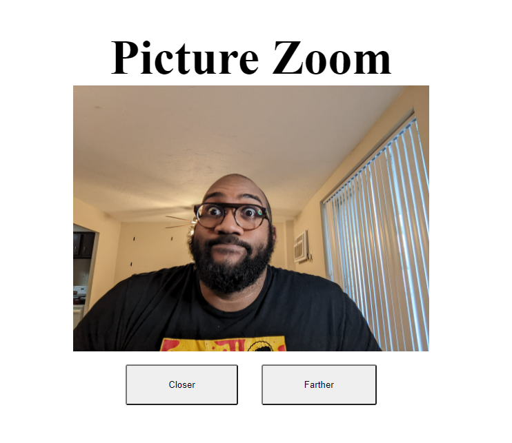

# Picture Zoom

I created a picture zoom app. When the closer button is click a picture changes to a closer version of me

**Link to project:** https://musical-douhua-b38e92.netlify.app/

## How It's Made:

**Tech used:** HTML, CSS, JavaScript

## Lessons Learned:

- I learned how to add create elements in JS and add them to the DOM.
- Adding event listeners with arrow functions
- How to clear the DOM in JS! 

## Optimizations & Future Work:
 adding styling to the webpage.